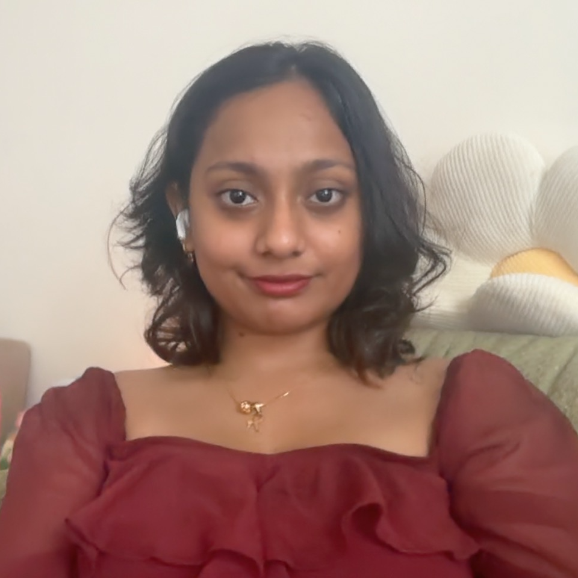
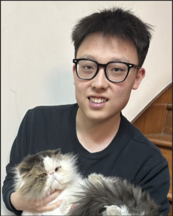
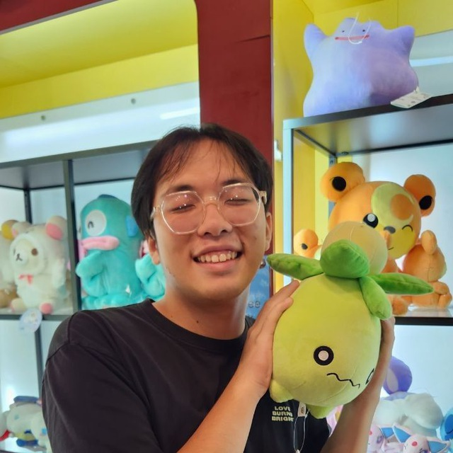
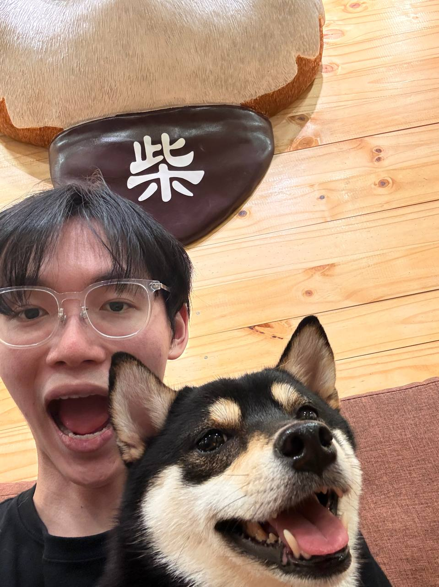
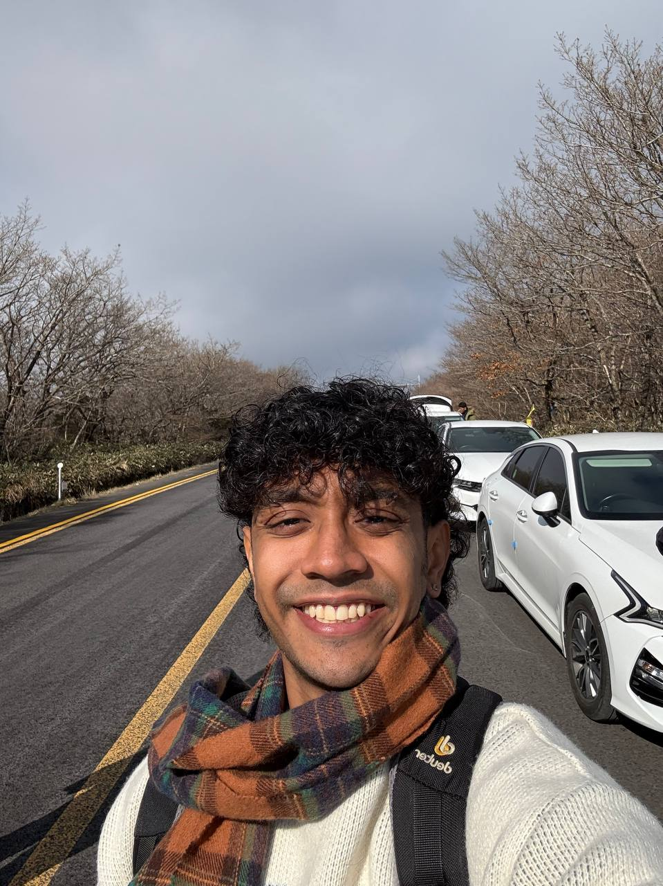

# About Us

We are a team based in the [School of Computing, National University of Singapore](http://www.comp.nus.edu.sg).

You can reach us at the email `seer[at]comp.nus.edu.sg`

## Project team

### John Doe

[[homepage](http://www.comp.nus.edu.sg/~damithch)]
[[github](https://github.com/johndoe)]
[[portfolio](team/johndoe.md)]

* Role: Project Advisor

### Raeeda Ibnat Hossain

[[github](http://github.com/Rae2480)]
[[portfolio](team/johndoe.md)]

* Role: Team Lead
* Responsibilities: UI

### Xu Zhehao

[[github](http://github.com/xzh119)] [[portfolio](team/xzh119.md)]

* Role: Team Lead
* Responsibilities: UI

### Timothy Soon

[[github](http://github.com/soonami69)] [[portfolio](team/soonami69.md)]

* Role: Integration
* Responsibilities: Scheduling and Tracking

### Sun Ze Dong

[[github](https://github.com/zedonggg)]
[[portfolio](team/johndoe.md)]

* Role: Developer
* Responsibilities: Dev Ops + Threading

### Hrishikesh Sathyian

[[github](http://github.com/hrishikeshsathyian)]
[[portfolio](team/johndoe.md)]

* Role: Developer
* Responsibilities: Full Stack
