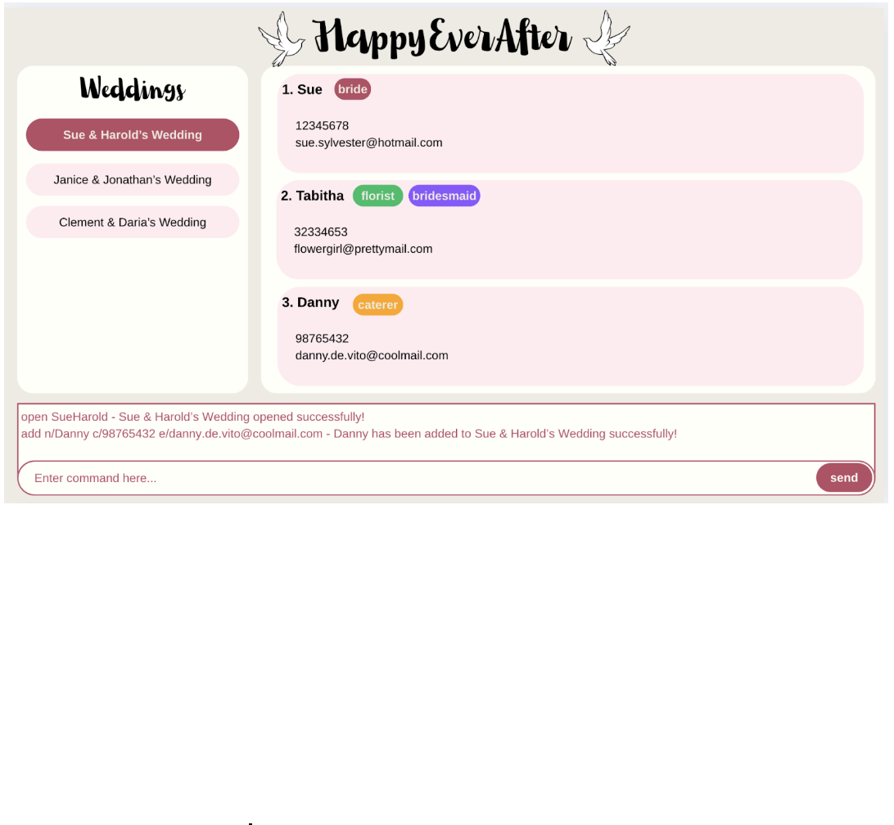

# HappyEverAfter User Guide

Welcome to HappyEverAfter - a quick, robust, intuitive Wedding Planner designed to help wedding organisers keep track of their weddings. HappyEverAfter provides a plethora of features, such as the creation of weddings, and the adding of members with roles to each wedding. Wedding Planning can get hectic, especially for a busy planner like you, and with just some typing commands, HappyEverAfter can help you get organised and sorted in no time! 

<!-- * Table of Contents -->
# Table of Contents
1. [Quick Start](#quick-start)
2. [Command Formats](#feature-details)
3. [Features](#features)
    - [System Commands](#system-commands)
        - [Viewing help](#viewing-help--help)
        - [Exiting the program](#exiting-the-program-exit)
    - [Wedding Management](#wedding-management)
        - [Creating a new wedding](#creating-a-wedding-add)
        - [Opening a wedding](#opening-a-wedding--open)
        - [Closing a wedding](#closing-the-current-wedding-closewedding)
        - [Listing all weddings](#listing-all-weddings-list)
        - [Sorting weddings by date](#sorting-weddings-by-date-sort)
    - [Member Management](#member-management-)
        - [Adding a person to a wedding](#adding-a-person-add)
4. [Data Storage](#data-storage)
5. [FAQ](#faq)
7. [Command Summary](#command-summary)

--------------------------------------------------------------------------------------------------------------------

## Quick start

1. Ensure you have Java `17` or above installed in your Computer. 
   - Java Installation
   - **Mac users:** Ensure you have the precise JDK version prescribed [here](https://se-education.org/guides/tutorials/javaInstallationMac.html).
2. Download the latest version of HappyEverAfter
   - Click the following link [here](https://github.com/AY2425S2-CS2103T-W09-4/tp/releases) and download the file `happilyeverafter.jar`.
3. Move the file to the folder
    - Copy the file to the folder you want to use as the _home folder_ for your HappyEverAfter.
4. Running HappyEverAfter
    - Open the "Command Prompt" (for Windows) or "Terminal" (for Mac/Linux).
    - Enter `cd` followed by the folder location where you saved the EduConnect file. For example:
        - On Windows: `cd C:\Users\JohnDoe\Desktop\HappyEverAfter`
        - On Mac/Linux: `cd /Users/JohnDoe/Desktop/HappyEverAfter`
    - Then run this command to launch HappyEverAfter:
      `java -jar happilyeverafter.jar`
   - A Graphical User Interface (GUI) similar to the image below should appear in a few seconds. Note how the app contains some sample data.

      

5. Type the command in the command box and press Enter to execute it. 
   - See [features](#features) for the list of all possible commands to execute

[Back to Table of Contents](#table-of-contents-)

--------------------------------------------------------------------------------------------------------------------

## Feature-Details

<box type="info" seamless>

**Notes about the command format:** 

* Words in `UPPER_CASE` are the parameters to be supplied by the user. 
  e.g. in `new n/WEDDING_NAME`, you should replace `WEDDING_NAME` with the actual name, like `new n/John & Mary`.

* Items in square brackets are optional. 
  e.g `n/NAME [t/TAG]` can be used as `n/John Doe t/friend` or simply as `n/John Doe`.

* Items with `…`​ after them can be used multiple times including zero times. 
  e.g. `[t/TAG]…​` can be used as ` ` (i.e. 0 times), `t/friend`, `t/friend t/family` etc.

* Parameters can be provided in any order. 
  e.g. if the command specifies `n/NAME p/PHONE_NUMBER`, `p/PHONE_NUMBER n/NAME` is also acceptable.

* Extraneous parameters for commands that do not take in parameters (such as `help`, `list`, `exit` and `clear`) will be ignored. 
  e.g. if the command specifies `help 123`, it will be interpreted as `help`.

* The `DATE` Parameter has to be in the format `DDMMYYYY` 
  * e.g `25122025` for the 25th December 2025

* The `EMAIL` Parameter has to be a valid email address
    * e.g `e\hrishikeshsathyian2002@gmail.com` 
</box>

* Special role tags to identify the bride and groom:
    * Use `t/bride` to designate a person as the bride
    * Use `t/groom` to designate a person as the groom
    * A wedding must have both a bride and groom to be valid

# Features

## System commands

### Viewing help : `help`

Shows a message explaining how to access the User Guide.

Format: `help`

### Exiting the program: `exit`

Exits the HappyEverAfter application.

Format: `exit`

## Wedding Management

### Creating a wedding: `add`

Adds a wedding to the wedding planner.  

Format: `new n/WEDDING_NAME d/DATE`

Examples: 
* `new n/John & Mary d/25122025`

### Opening a wedding : `open`

Opens a wedding from the Wedding Planner to view its persons.

Format: `open INDEX`

Examples:
* `open 1` (Opens the first wedding in the list)
* `open 3` (Opens the third wedding in the list)

### Closing the current wedding: `closewedding`

Closes the currently open wedding project to return to the main view.

Format: `closewedding`

### Listing all weddings: `list`

Shows a list of all weddings in the wedding planner.

Format: `list`

### Sorting weddings by date: `sort`

Shows a list of all weddings in the wedding planner, organised from earliest to latest.

Format:  `sort`

## Member Management 

### Adding a person: `add`

Adds a person to the **active** Wedding Planner.
Use tags to specify if the person is a bride, groom, or other wedding party member.

Format: `add n/NAME p/PHONE_NUMBER e/EMAIL a/ADDRESS [t/TAG]…​`

**Note:** 

* Active refers to the wedding associated with the last `open` or `new` command
* Each wedding must have exactly one bride and one groom.
* Use `t/bride` to designate a person as the bride.
* Use `t/groom` to designate a person as the groom.
* Other people added without these special tags will be considered as wedding party members.
* A person can have any number of tags (including 0)

Examples:
* `add n/Mary Muller p/98765432 e/mary@example.com a/123 Kentridgr St t/bride`
* `add n/John Danny p/89989788 e/john@example.com a/456 UTR Ave t/groom`
* `add n/Harry Kane p/13701978 e/kane@example.com a/789 NUS Rd t/bridesmaid`

## Data Storage

### Saving the data

AddressBook data are saved in the hard disk automatically after any command that changes the data. There is no need to save manually.

### Editing the data file

AddressBook data are saved automatically as a JSON file `[JAR file location]/data/addressbook.json`. Advanced users are welcome to update data directly by editing that data file.

<box type="warning" seamless>

**Caution:**
If your changes to the data file makes its format invalid, AddressBook will discard all data and start with an empty data file at the next run.  Hence, it is recommended to take a backup of the file before editing it. 
Furthermore, certain edits can cause the AddressBook to behave in unexpected ways (e.g., if a value entered is outside the acceptable range). Therefore, edit the data file only if you are confident that you can update it correctly.
</box>

<!-- ### Archiving data files `[coming in v2.0]`

_Details coming soon ..._ -->

--------------------------------------------------------------------------------------------------------------------

## FAQ

**Q**: How do I transfer my wedding planner data to another computer?  
**A**: Install HappyEverAfter on the other computer and replace the empty data file it creates with the file from your original installation (located at `/data/weddingplanner.json`).

**Q**: Can I add multiple weddings at once?  
**A**: No, you need to create weddings one at a time using the `new` command.

**Q**: What happens if I try to add a second bride or groom to a wedding?  
**A**: The system will display an error message as each wedding can have only one bride and one groom.

**Q**: How many people can I add to a wedding?  
**A**: At most 100 members for one wedding.

--------------------------------------------------------------------------------------------------------------------

## Command summary

Action     | Format, Examples
-----------|----------------------------------------------------------------------------------------------------------------------------------------------------------------------
| **Help** | `help` |
| **Create Wedding** | `new n/WEDDING_NAME d/DATE` e.g., `new n/John & Mary d/25122025` |
| **Open Wedding** | `open INDEX` e.g., `open 2` |
| **Close Wedding** | `closewedding` |
| **List Weddings** | `list` |
| **Sort Weddings by Date** | `sort` |
| **Add Person** | `add n/NAME p/PHONE e/EMAIL a/ADDRESS [t/TAG]...` e.g., `add n/Mary Smith p/98765432 e/mary@example.com a/123 Wedding St t/bride` |
| **Exit** | `exit` |
