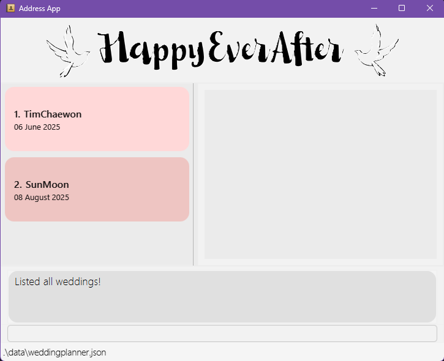
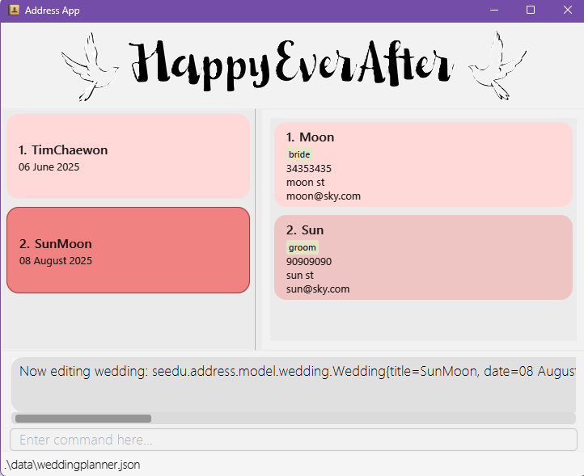

# HappyEverAfter User Guide

Welcome to HappyEverAfter - a quick, robust, and intuitive Wedding Planner designed to help wedding organisers keep track of their weddings. HappyEverAfter provides a plethora of features, such as the creation of weddings, and the adding of people with roles to each wedding. Wedding Planning can get hectic, especially for a busy planner like you, and with just some typing commands, HappyEverAfter can help you get organised and sorted in no time!

<!-- * Table of Contents -->
## Table of Contents

1. [Quick Start](#quick-start)
2. [Command Formats](#feature-details)
3. [Features](#features)
    - [Wedding Management](#wedding-management)
        - [Creating a new wedding](#creating-a-wedding-new)
        - [Opening a wedding](#opening-a-wedding--open)
        - [Closing a wedding](#closing-the-current-wedding-close)
        - [Listing all weddings](#listing-all-weddings-list)
        - [Sorting weddings by date](#sorting-weddings-by-date-sort)
        - [Deleting a wedding](#deleting-a-wedding-delete)
        - [Deleting all weddings](#clearing-all-weddings-ca)
    - [Member Management](#member-management)
        - [Adding a person to a wedding](#adding-a-person-to-a-wedding-add)
        - [Finding people of weddings](#finding-people-find)
        - [Filtering for people by tags](#filtering-by-tag-filter)
        - [Removing a person](#removing-a-person-remove)
        - [Editing a person](#editing-a-person-edit)
    - [System Commands](#system-commands)
        - [Viewing help](#viewing-help--help)
        - [Exiting the program](#exiting-the-program-exit)
4. [Data Storage](#data-storage)
5. [FAQ](#faq)
7. [Command Summary](#command-summary)

--------------------------------------------------------------------------------------------------------------------

## Quick start

1. Ensure you have Java `17` or above installed in your Computer. 
   - [Java Installation](https://www.java.com/en/download/help/download_options.html)
   - **Mac users:** Ensure you have the precise JDK version prescribed [here](https://se-education.org/guides/tutorials/javaInstallationMac.html).
2. Download the latest version of HappyEverAfter
   - Click the following link [here](https://github.com/AY2425S2-CS2103T-W09-4/tp/releases) and download the file `happyeverafter.jar`.
3. Move the file to the folder
    - Copy the file to the folder you want to use as the _home folder_ for your HappyEverAfter.
4. Here are the steps for you to run HappyEverAfter
   - Open the "Command Prompt" (for Windows) or "Terminal" (for Mac/Linux).
   - Enter `cd` followed by the folder location where you saved the HappyEverAfter file. For example:
     - On Windows: `cd C:\Users\JohnDoe\Desktop\HappyEverAfter`
     - On Mac/Linux: `cd /Users/JohnDoe/Desktop/HappyEverAfter`
   - Run this command to launch HappyEverAfter: `java -jar happyeverafter.jar`
   - A Graphical User Interface (GUI) similar to the image below should appear in a few seconds. Note how the app contains some sample data.

      

5. Type the command in the command box and press Enter to execute it.
   - See [features](#features) for the comprehensive list of all possible commands to execute and [command summary](#command-summary) for a brief overview.

[Back to Table of Contents](#table-of-contents)

--------------------------------------------------------------------------------------------------------------------

## Feature-Details

<box type="info" seamless>

### Things you need to know about the features:

- Commands are case-insensitive.
  - e.g. `Help` and `help` will run the same command.
  - However, parameters are not case-sensitive, unless stated otherwise.
  
- Words in `UPPER_CASE` are the parameters to be supplied by you, the user.
  - e.g. in `new n/WEDDING_NAME`, you should replace `WEDDING_NAME` with the actual name, like `new n/John & Mary`

- Items in square brackets are optional.
  - e.g `n/NAME [t/TAG]` can be used as `n/John Doe t/friend` or simply as `n/John Doe`.

- Items with `…`​ after them can be used multiple times including zero times.
  - e.g. `[t/TAG]…​` can be used as ` ` (i.e. 0 times), `t/friend`, `t/friend t/family` etc.

- Parameters can be provided in any order.
  - e.g. if the command specifies `n/NAME p/PHONE_NUMBER`, `p/PHONE_NUMBER n/NAME` is also acceptable.

- Extraneous parameters for commands that do not take in parameters (such as `help`, `list`, `exit` and `clear`) will be ignored.
  - e.g. if the command specifies `help 123`, it will be interpreted as `help`.

 - Special role tags to identify the bride and groom:
    - Use `t/bride` to designate a person as the bride
    - Use `t/groom` to designate a person as the groom
    - A wedding must have both a bride and groom to be valid
</box>

  
[Back to Table of Contents](#table-of-contents)

# Features

## Wedding Management

### Listing all weddings: `list`

You can view a list of all weddings in the wedding planner.

Format: `list`

### Creating a wedding: `new`

You can create and add a new wedding to the wedding planner.

Format: `new n/WEDDING_NAME d/DATE`

Example:
- `new n/John & Mary d/25122025`

<box type="info">
Note:

- HappyEverAfter will prompt you immediately to enter the details of the bride and the groom to confirm
  the wedding.
  - Each wedding must have exactly one bride and one groom.
  - Use `t/bride` to designate a person as the bride.
  - Use `t/groom` to designate a person as the groom.
  - Other people added without these special tags will be considered as wedding party members.
- See [Adding a person to a wedding](#adding-a-person-to-a-wedding-add) for more details.
- You cannot add a wedding with the exact same `WEDDING_NAME` and `DATE` as one that already exists.
</box>

<box type="info">

++**Restrictions on Parameters**++

**Names:**

- Should not be blank.
- Should be case-sensitive.
- Can contain any amount of alphanumeric characters, spaces, and special characters.
- May not include bride and groom's name.

**Dates:**

- The `DATE` Parameter has to be in the format `DDMMYYYY`.
  - e.g `25122025` for the 25th December 2025
- Can be any date, past, present or future.

</box>

### Opening a wedding : `open`

You can open a wedding from the Wedding Planner to view its people and edit its people.

Format: `open INDEX`

Examples:

- `open 1` (Opens the first wedding in the list)
- `open 3` (Opens the third wedding in the list)

After a weddings is open, you will be able to see the people belongs to it on the right:

<box type="tip">

**Tip:** You can open a new wedding without closing the current one. HappyEverAfter will automatically close the current wedding and open the new one.

</box>

### Closing the current wedding: `close`

You can close the currently open wedding project to return to the main view.

Format: `close`

### Sorting weddings by date: `sort`

You can view the displayed weddings by chronological order - with the earliest wedding at the top.

Format: `sort`

### Deleting a wedding: `delete`

You can delete a wedding from the wedding planner based on the provided index.

Format: `delete INDEX`

Examples:

- `delete 1` (Deletes the first wedding in the list)
- `delete 3` (Deletes the third wedding in the list)

<box type="info">
Note:

- You can delete any wedding (even the open one) regardless if there is a wedding open or not.
- When deleting the open wedding, you will still be able to run commands on it. However, no data will be saved.

</box>

### Clearing all weddings: `ca`

Deletes All weddings and associated contacts from the wedding planner. 

Format:
- `ca` followed by `y` will delete all weddings from the wedding planner.
- `ca` followed by `n` will abort the delete operation, and it will not clear the weddings.

<box type="info">
Note:

- To prevent accidental deletions, there will be a secondary confirmation prompt issued after `clearallweddings` to
  confirm the deletion.

</box>

[Back to Table of Contents](#table-of-contents)

## People Management

### Adding a person to a wedding: `add`

You can add a person to the [opened](#opening-a-wedding--open) Wedding Planner.
You can use tags to specify if the person is a bride, groom, or other wedding party participant.

Format: `add n/NAME p/PHONE_NUMBER e/EMAIL a/ADDRESS [t/TAG]…​`

Examples:

- `add n/Mary Muller p/98765432 e/mary@example.com a/123 Kentridgr St t/bride`
- `add n/John Danny p/89989788 e/john@example.com a/456 UTR Ave t/groom`
- `add n/Harry Kane p/13701978 e/kane@example.com a/789 NUS Rd t/bridesmaid`

<box type="info">

++**Restrictions on Parameters**++

**Names:**
- Should not be blank.
- Can be any length.
- Can only contain alphanumeric characters, spaces and limited special characters(, ' . -)
- Can not start with the special character.
- Should not be identical to any person already in the wedding.
  - e.g. If a person with the name of "Ma Dong-Seok" already exists in the wedding,
    - A person by the name of "ma Dong-Seok" can be added.
    - A person by the name of "Ma  Dong-Seok" (with two spaces between "Ma" and "Dong-Seok") can be added.
    - A person by the name of "Ma Dong-Seok" cannot be added.

**Phone numbers:**
- Should not be blank.
- Should only contain numbers (no letters, spaces or special characters).
- Can be any length.

**Email addresses:**
- Should be of the format `LOCAL_PART@DOMAIN`, with the following constraints:
- `LOCAL_PART` has the following constraints:
  - Should only consist of alphanumeric characters and these special characters: `+_.-`.
  - Should not be blank.
  - Should not start or end with any of the above special characters.
- `DOMAIN` is a domain name, which is made up of 1 or more domain labels separated by periods.
- Each domain label has the following constraints:
  - Be at least 2 characters long.
  - Should start and end with alphanumeric characters.
  - Should consist only of alphanumeric characters, separated only by hyphens, if any.

**Addresses:**

- Should not be blank.
- Can take any value.

**Tags:**
- Should consist only alphanumeric characters, with no spaces
- Should be case-sensitive: A tag "Brother" is considered different from "brother".
  - The only exception to this are the `groom` and `bride` tags. Case-insensitive variations of them will not be permitted if the wedding already has a person with that corresponding tag.
- Only one person in each wedding may have the `groom` and `bride` tag, specified with `t/groom` and `t/bride` respectively.
  - However, a bride and groom may have other tags.
- Can have any number of tags (including 0)

</box>

### Finding people: `find`

You can view all weddings with people that match the provided search terms, and HappyEverAfter will show the information of 
all weddings with people that match any of the terms provided.

Format: `find [SEARCH TERMS]`

Examples:

- `find Sun`
- `find Sun Hrishi`
- `find sun`

<box type="info" seamless>

++**Note:**++

- Search term should not be blank.
- Search term may not be case-sensitive.
- Can have any number of search terms.

</box>

<box type="tip" seamless>

**Tip:** You can use open command to view a specific wedding.

</box>

### Filtering by tag: `filter`

You can filter the list of the currently [opened](#opening-a-wedding--open) wedding to display all people with the specified tag.

Format: `filter [TAGS]`

Examples:

- `filter bride` (Displays only the bride)
- `filter groom` (Displays only the groom)
- `filter` (Displays all people without filtering)

<box type="info" seamless>

++**Note:**++

- Tags are case-sensitive.

</box>

<box type="tip">

**Tip:** If you want to remove the filters, use the filter command with no tags, i.e. `filter`

</box>

### Removing a person: `remove`

You can remove a person from the currently [opened](#opening-a-wedding--open) wedding based on the provided index.
The index refers to the index number shown in the displayed list. The index **must be a positive integer**.

Format: `remove INDEX`

Example:

- `remove 3` (Removes the third person in the list)

<box type="info" seamless>

++**Note:**++

- You cannot remove a bride or groom from a wedding. Every wedding must maintain both roles.

</box>

### Editing a person: `edit`

You can edit the details of a person in the currently [opened](#opening-a-wedding--open) wedding.

Format: `edit INDEX [n/NAME] [p/PHONE] [e/EMAIL] [a/ADDRESS] [t/TAG]...`

Examples:

- `edit 1 p/91234567 e/newemail@example.com` (Updates phone and email of the first person)
- `edit 2 n/New Name a/New Address` (Updates name and address of the second person)

<box type="info">

++**Note:**++

 - You cannot edit the `bride/groom` tags of a person.
 - At least one field must be provided for editing.
 - When editing tags, the existing tags of the person will be removed.
  - e.g. if the person already has the tag `Brother`, and you want to add a new tag `Coming`, you will have to run the command `edit INDEX t/Brother t/Coming`.
  - If you want to remove all tags from a person, you can enter `t/` with no tags behind. This will remove all tags from the person at the specified index.

**Restrictions on Parameters:**

- See **Restrictions on Parameters** in the [add command](#adding-a-person-to-a-wedding-add) for more details.
</box>

<box type="tip">

**Tip:** If you need to change the bride or groom of a wedding, use the edit commands to change their information instead of altering the tags of another person to make them bride/groom.

</box>

[Back to Table of Contents](#table-of-contents)

## System commands

### Viewing help : `help`

You can view a message explaining how to access the User Guide.

Format: `help`

### Exiting the program: `exit`

You can exit the HappyEverAfter application.

Format: `exit`

[Back to Table of Contents](#table-of-contents)

## Data Storage

### Saving the data

HappyEverAfter data is saved in the hard disk automatically after any command that changes the data. There
is no need to save manually.

### Editing the data file

HappyEverAfter data is saved automatically as a JSON file `[JAR file location]/data/weddingplanner.json`.
Advanced users are welcome to update data directly by editing that data file.

<box type="warning">

**Caution:**
If your changes to the data file makes its format invalid, HappyEverAfter will discard all data and start
with an empty data file at the next run.  Hence, it is recommended to take a backup of the file before editing it. 
Furthermore, certain edits can cause HappyEverAfter to behave in unexpected ways (e.g., if a value entered is
outside the acceptable range). Therefore, edit the data file only if you are confident that you can update it correctly.

</box>

--------------------------------------------------------------------------------------------------------------------

[Back to Table of Contents](#table-of-contents)

## FAQ

**Q**: How do I transfer my wedding planner data to another computer?\
**A**: Install HappyEverAfter on the other computer and replace the empty data file it creates with the file from your original installation (located at `/data/weddingplanner.json`).

**Q**: Can I add multiple weddings at once?\
**A**: No, you need to create weddings one at a time using the `new` command. Alternatively, for advanced users: you may update the data file yourself. Look through the ["Editing the data file" section](#editing-the-data-file) for more support.

**Q**: What happens if I try to add a second bride or groom to a wedding?\
**A**: The system will display an error message as the current implementation of HappyEverAfter supports only one bride and one groom per wedding.

**Q**: How many people can I add to a wedding?\
**A**: As of the most recent version, you can add at most 100 people for one wedding.

**Q**: I renamed the bride and groom of a wedding. How do I change the wedding name?\
**A**: The system currently does not support the editing of wedding names directly. However, you may update the data file yourself. Look through the ["Editing the data file" section](#editing-the-data-file) for more support.

--------------------------------------------------------------------------------------------------------------------
[Back to Table of Contents](#table-of-contents)

## Command summary

| Action                    | Format, Examples                                                                                                     
|---------------------------|----------------------------------------------------------------------------------------------------------------------
| **Create Wedding**        | `new n/WEDDING_NAME d/DATE` e.g., `new n/John & Mary d/25122025`                                                  |
| **Open Wedding**          | `open INDEX` e.g., `open 2`                                                                                       |
| **Close Wedding**         | `close`                                                                                                              |
| **List Weddings**         | `list`                                                                                                               |
| **Sort Weddings by Date** | `sort`                                                                                                               |
| **Delete Wedding**        | `delete INDEX` e.g., `delete 2`                                                                                   |
| **Clear All Weddings**    | `ca`                                                                                                                 |
| **Add Person**            | `add n/NAME p/PHONE e/EMAIL a/ADDRESS [t/TAG]...` e.g., `add n/Mary Smith p/98765432 e/mary@example.com a/123 Wedding St t/bride` |
| **Find Person**           | `find [SEARCH TERMS]` e.g., `find John Doe`                                                                       |
| **Filter People by Tag**  | `filter [TAG]` e.g., `filter groom`                                                                               |
| **Remove Person**         | `remove INDEX` e.g., `remove 3`                                                                                   |
| **Edit Person**           | `edit INDEX [n/NAME] [p/PHONE] [e/EMAIL] [a/ADDRESS] [t/TAG]...` e.g., `edit 1 p/91234567 e/newemail@example.com` |
| **Help**                  | `help`                                                                                                               |P
| **Exit**                  | `exit`                                                                                                               |
